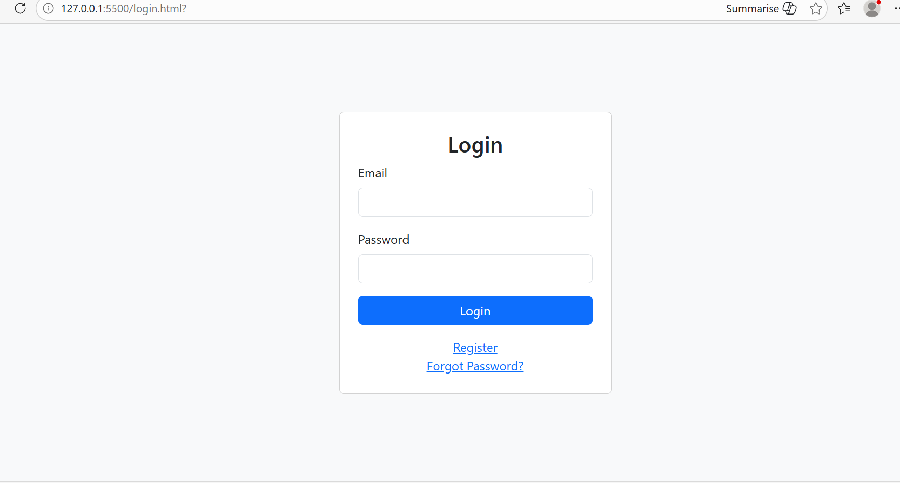
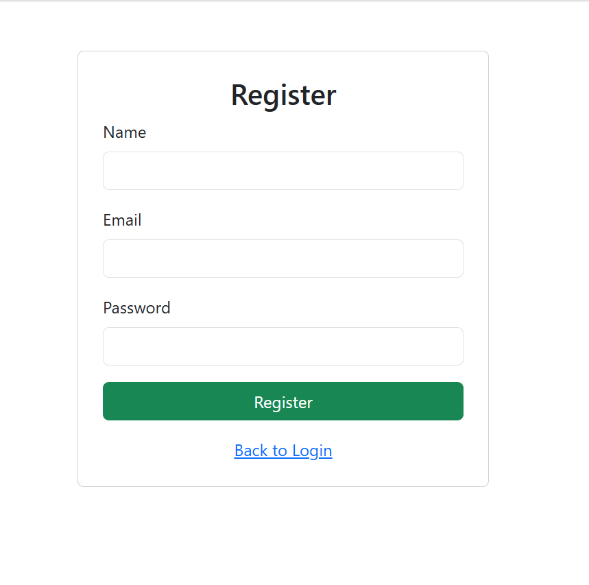
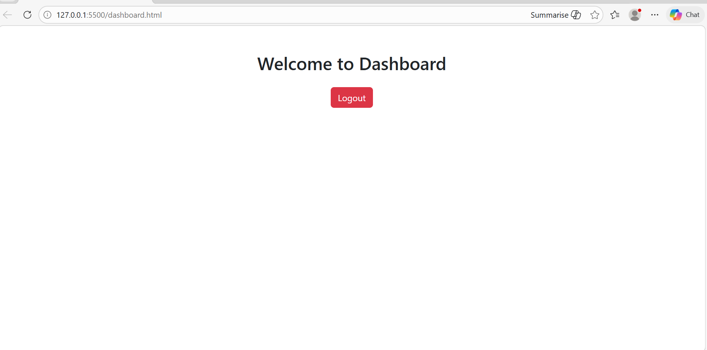
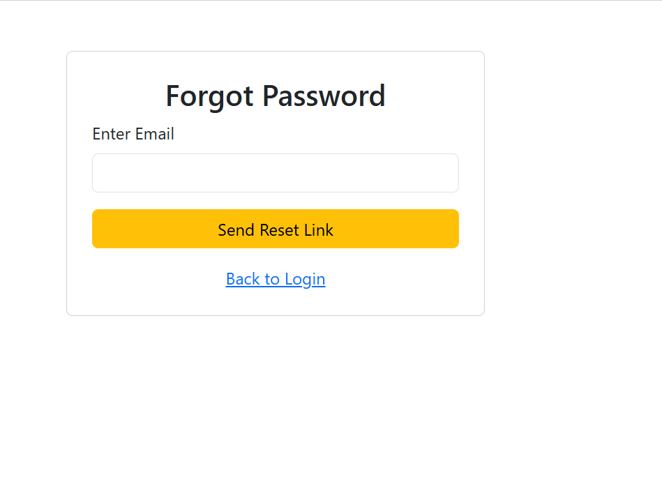
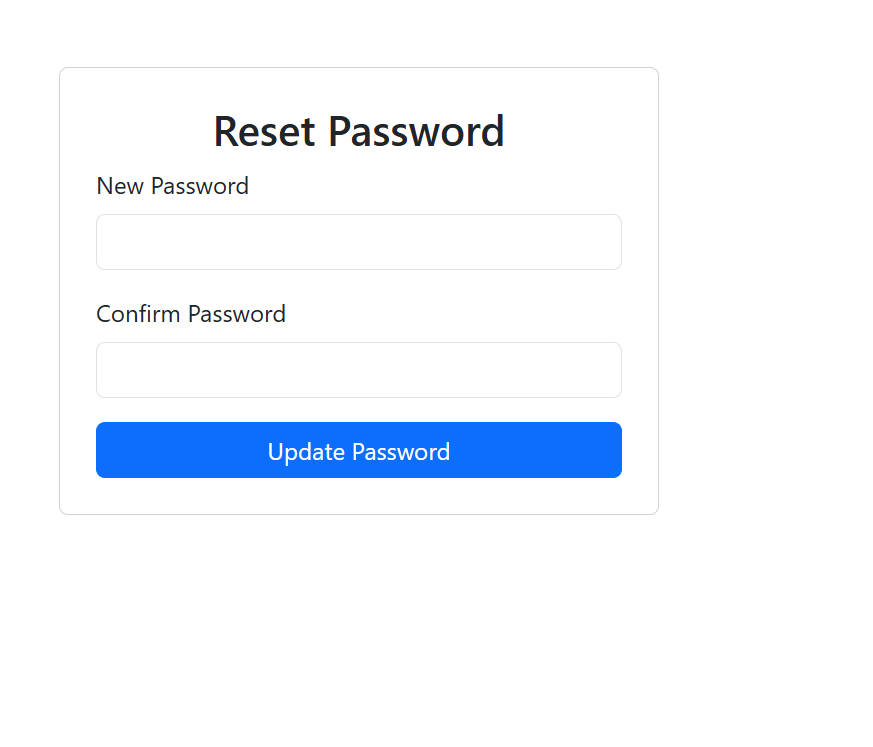

# HTML Authentication UI

This project is a simple authentication UI built using HTML, CSS, and Bootstrap.

## Pages Included
- Login Page
- Register Page
- Forgot Password Page
- Reset Password Page
- Dashboard Page

## Features
- Navigation between all pages
- Simple and clean UI using Bootstrap
- Responsive design

## Screenshots

### Login Page

### Register Page

### Dashboard Page

### Forgot-Password Page

### Reset-Password Page
